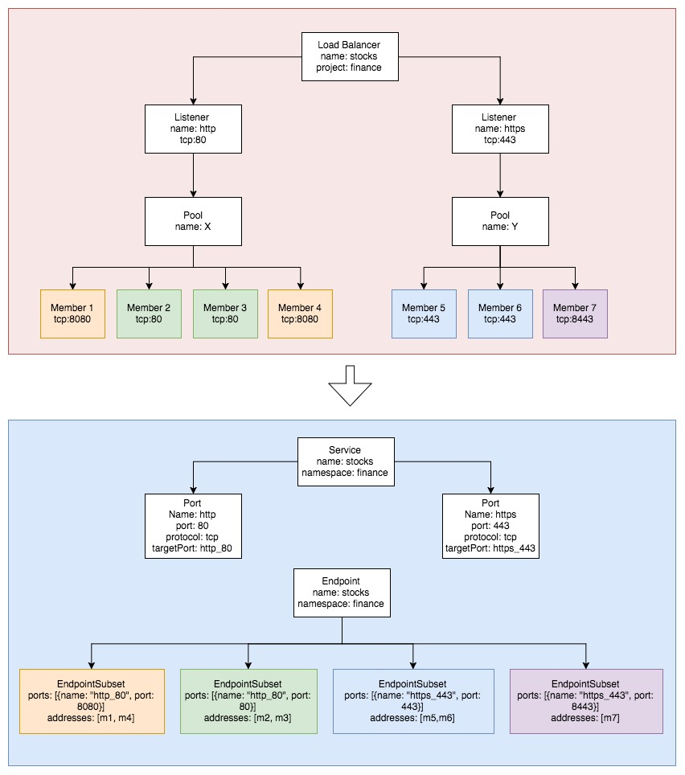

# OpenStack Discoverer

## Executive Summary

Izzy enables organizations to route ingress traffic to endpoints that live off-cluster, including endpoints that are
running on OpenStack. The OpenStack discoverer keeps OpenStack resources in sync with the equivalent resources in the
Gimbal cluster. It achieves this by connecting to a target OpenStack cluster, translating all Load Balancers into
Services and Endpoints, and reconciling them with the Gimbal cluster.

## Goals

- Reconcile Load Balancers and Endpoints of a target OpenStack cluster with the equivalent resources in the Gimbal
  cluster, so that the Gimbal cluster can route traffic to OpenStack servers.
- Support OpenStack Mitaka as the minimum version.

## Background

Similar to the Kubernetes Discoverer, the OpenStack Discoverer (discoverer) will connect to a single target cluster.
Given that there is no support for watching the OpenStack API, the discoverer will poll the API according to a
configurable interval.

On each poll tick, the discoverer will list all load balancers, translate them into Kubernetes Services, and reconcile
them with the corresponding Services in the Gimbal cluster. For each load balancer, the discoverer will use the LB's
metadata to determine the servers that are serving traffic behind the load balancer. Once the list of servers is known,
the discoverer will create Kubernetes Endpoints, and reconcile them with the corresponding Endpoints in the Gimbal
cluster.

## Detailed Design

### Resource Names

Given that Izzy will support multiple OpenStack clusters, all the resources synced by the OpenStack discoverer must be
scoped to a specific cluster to avoid collisions.

Thus, the `name` of synced Services and Endpoints will be `BackendName-Name`:

- `BackendName`: The name of the OpenStack cluster. This is configurable through a command-line flag.
- `Name`: The OpenStack Load Balancer's name concatenated (using hyphen as a separator) with the Load Balancer's ID. If
  the load balancer does not have a name, the ID is used. (Names are optional in OpenStack).

The `name` of Services and Endpoints will be subject to a maximum length of 63 characters, which is the limit imposed by
Kubernetes on Service names. In the case that the name is longer than the limit, the name will be hashed.

### Resource Reconciliation

The discoverer needs to reconcile the resources defined in the OpenStack cluster with the equivalent resources in the
Gimbal cluster.

First, the discoverer will list all Load Balancers defined in the OpenStack cluster and translate them into Kubernetes
Services and Endpoints. Then, the discoverer will list the Services and Endpoints in the Gimbal cluster that belong to
the OpenStack cluster being discovered. Finally, the discoverer will perform a diff between what exists in the OpenStack
cluster versus what exists in the Gimbal cluster and perform the necessary additions, updates or deletions to reconcile
the state.

It is important to note that the discoverer assumes it is the only agent that can touch the resources that it is
responsible for. This means that any changes made by another process or user to resources that belong to the discoverer
will be overwritten.

### Authentication

The administrator must provide a username and password for the discoverer to access the OpenStack API. The discoverer
will use these credentials to authenticate against the *Keystone v3 API* and obtain an _unscoped_ authentication token.

Given that the *LBaaS v2 API* is scoped to a project, the discoverer will need the ability to list the projects that exist
in the cluster to be able to discover load balancers and endpoints across all projects. More importantly, the
credentials provided by the administrator must be valid for all the projects returned in the list, as the discoverer
will have to obtain a _scoped_ token for each one of them.

The OpenStack credentials will be provided through a Kubernetes secret:

```yaml
apiVersion: v1
kind: Secret
metadata:
  namespace: ingresszilla
  name: openstack001-access-secret
type: Opaque
data: # all values are base64 encoded
  keystoneUrl: http://openstack001:5000/v3/
  neutronUrl: http://openstack001:9696/
  username: someUser
  password: secretPassword
  userDomain: default
  certificateAuthorityData: <base64 encoded CA cert> # Optional
```

In the case that authentication fails and we are able to determine the problem to be invalid credentials, the discoverer
will log the failure and exit. This will result in a restart loop, which should work as a signal that something is
wrong. To fix the issue, the operator will have to update the secret with correct credentials.

### Load Balancer -> Service Translation

The OpenStack equivalent of a Kubernetes Service is a Load Balancer. The discoverer will use the LBaaS v2 API to obtain
the Load Balancers defined in the cluster.

The following table describes the information needed to build the Kubernetes Service, and how it will be obtained from
the OpenStack Load Balancer:

| Service             | Load Balancer                                  |
|---------------------|------------------------------------------------|
| `Namespace`         | `ProjectId -> Project Name`                    |
| `Name`              | `BackendName-Name`                             |
| `Ports[i].Name`     | `Listeners[i].Name-Listeners[i].Protocol_Port` |
| `Ports[i].Protocol` | `Listeners[i].Protocol`                        |
| `Ports[i].Port`     | `Listeners[i].Protocol_Port`                   |

### Load Balancer Listener/Pool -> Endpoint Translation

Each Listener defines a protocol and port on which the Load Balancer accepts traffic. Additionally, each listener is
associated with a Pool, which contains a list of Servers (members) that serve content through the Load Balancer.

For each Load Balancer that is discovered, the discoverer will use the LBaaS v2 API to build a Kubernetes Endpoint from
the Load Balancer's Listeners, Pools and Pool Members.

The Kubernetes Endpoint will be derived as follows:

- Set the `name` to `BackendName-Name`
- For each Listener, group all members that are listening on the same port into an `EndpointSubset`.
- Set the `name` of the `EndpointPort` to `port-${Listeners[i].Protocol_Port}`.
- Set the `addresses` list of the `EndpointSubset` to the list of IP addresses of each member in the group.

### Sample Translation Scenario

The following diagram depicts a sample scenario where OpenStack resources are translated into their Kubernetes
equivalents. (Names simplified for brevity).



## Open Questions

- OpenStack Load Balancers support protocols = {TCP, HTTP, HTTPS}. Should we ignore non-TCP Load Balancers, or just
  always make them TCP?

## References

- [Mitaka LBaaS Documentation](https://docs.openstack.org/mitaka/networking-guide/config-lbaas.html)
- [Network / LBaaS v2 API Reference](https://developer.openstack.org/api-ref/network/v2/index.html)
- [Kubernetes Object Names Documentation](https://kubernetes.io/docs/concepts/overview/working-with-objects/names/)
