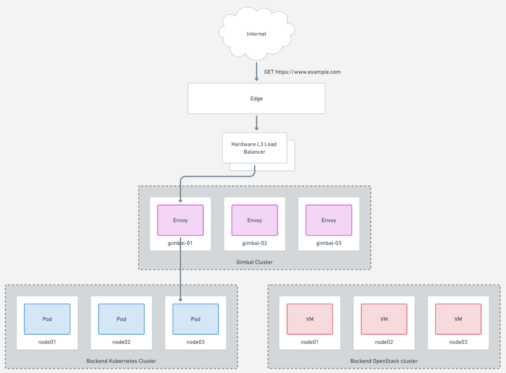

# Documentation

See the root-level README for an introduction, and the [deployment directory](../deployment/README.md) to get started with setting up and deploying Gimbal.

Here you can dig into the details of how Gimbal works, and explore more advanced topics for operators and users.

## Overview Guides

These guides describe how the components of Gimbal function and how they interact with other systems:

- [Kubernetes Discoverer](kubernetes-discoverer.md)
- [Openstack Discoverer](openstack-discoverer.md)

## Operator Topics

- [Manage Backend Clusters and Discovery](manage-backends.md)
- [List Discovered Services](list-discovered-services.md)
- [Update Kubernetes Discoverer Credentials](kubernetes-discoverer.md#updating-credentials)
- [Update OpenStack Discoverer Credentials](openstack-discoverer.md#updating-credentials)
- [Teams with Gimbal](teams.md)

## User Topics

- [Route Specification](route.md)
- [Dashboards / Monitoring / Alerting](monitoring.md)

## Data Flow

## Architecture Overview

More about the [Gimbal Architecture](gimbal-architecture.md).
