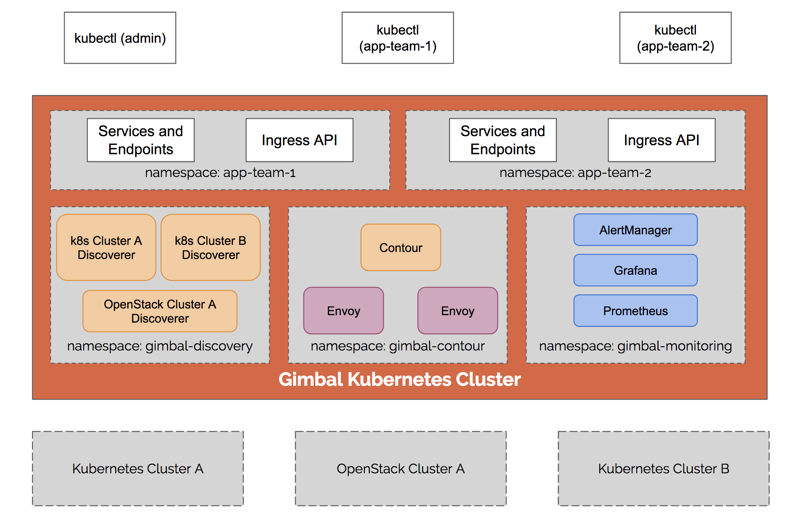
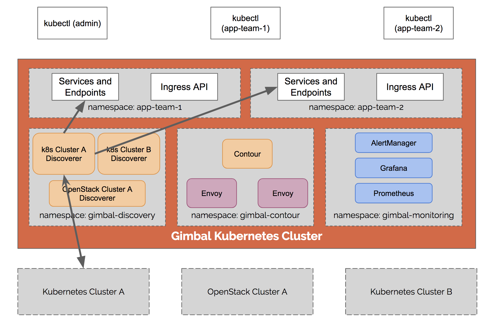
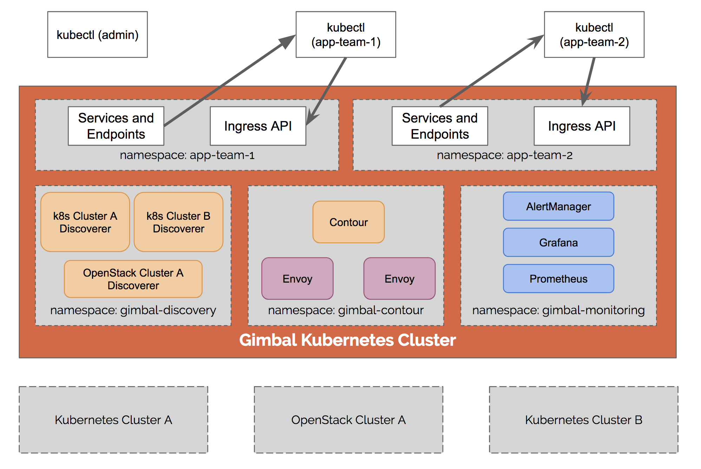
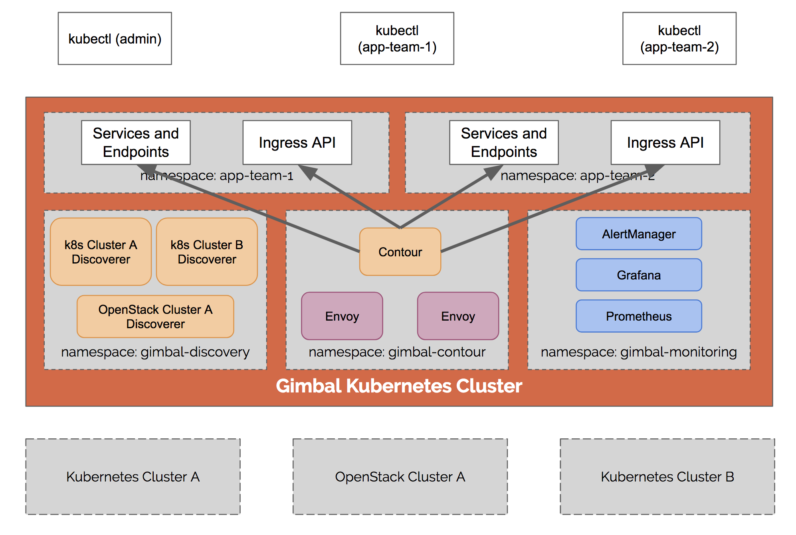
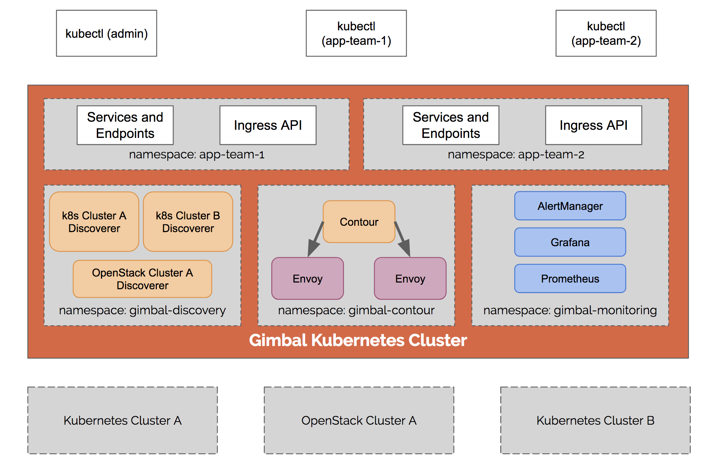

# Architecture

## High Level

Gimbal is designed to be deployed to one or more Kubernetes clusters that will act as a load balancing tier.  These load balancing clusters will then route traffic to one or more Kubernetes or OpenStack clusters.

## Gimbal Load Balancing Deployment 

Cluster administrators deploy Gimbal and its dependencies to the appropriate namespaces.

* Gimbal service discovery agents (one per upstream cluster) run in the `gimbal-discovery` namespace
* Contour and Envoy run in the `gimbal-contour` namespace
* The optional monitoring suite runs in the `gimbal-monitoring` namespace.

## Gimbal Service Discovery

Once deployed, the service discoverers continuously collect information about upstream applications running in the Kubernetes or OpenStack clusters and create corresponding `Service` and `Endpoint` objects in the appropriate team namespaces.

For example, assuming there is namespace in `Kubernetes Cluster A` called `app-team-1`, any Services and Endpoints discovered will be replicated in the Gimbal cluster within the `app-team-1` namespace.  Labels associated with the services are replicated as well.

The OpenStack discoverer provides similar behavior by monitoring all Load Balancers as a Service (LBaaS) configured as well as the corresponding Members. They are synchronized to the team's namespace as Services and Endpoints, with the namespace being configured as the TenantName in OpenStack.

## Multi-team Route Configuration

Development teams can see which Services are available to them by using standard Kubernetes tools like `kubectl`.  Services discovered by Gimbal are augmented with additional labels including the name of the cluster they were discovered which enables querying using selectors.

Developers create Kubernetes Ingress objects which define where inbound traffic (e.g. myapp.company.com) is routed.

## Contour

Contour is a Kubernetes Ingress Controller for Envoy that continuously monitors Ingress, Service, and Endpoint objects in the team namespaces.

Contour provides an Envoy API compatible GRPC endpoint which will dynamically modify the Envoy route configuration.

Envoy, deployed using the HostNetwork, provides the data plane for Gimbal.  Envoy is a high-performance load balancing proxy that physically routes ingress traffic to the upstream Kubernetes and OpenStack clusters.

## Monitoring

Gimbal includes an optional monitoring add-on that includes Prometheus, AlertManager, and Grafana.

Each Gimbal system component exposes a Prometheus-compatible /metrics route with health status and essential metrics that are aggregated by Prometheus and can be visualided using Grafana.