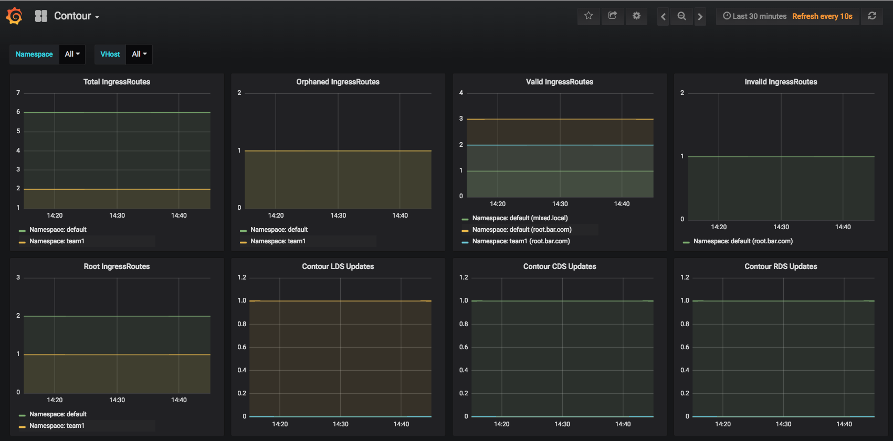
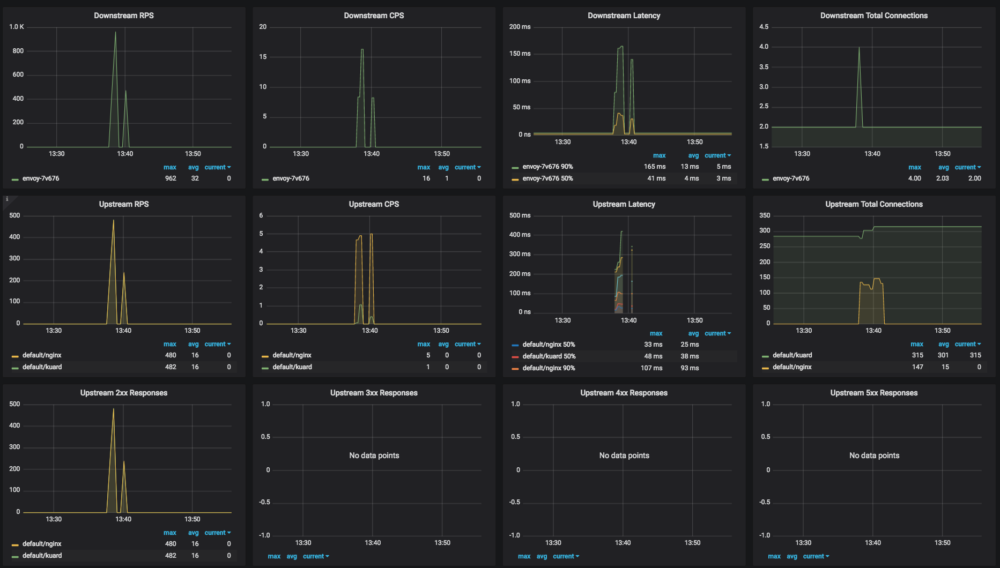
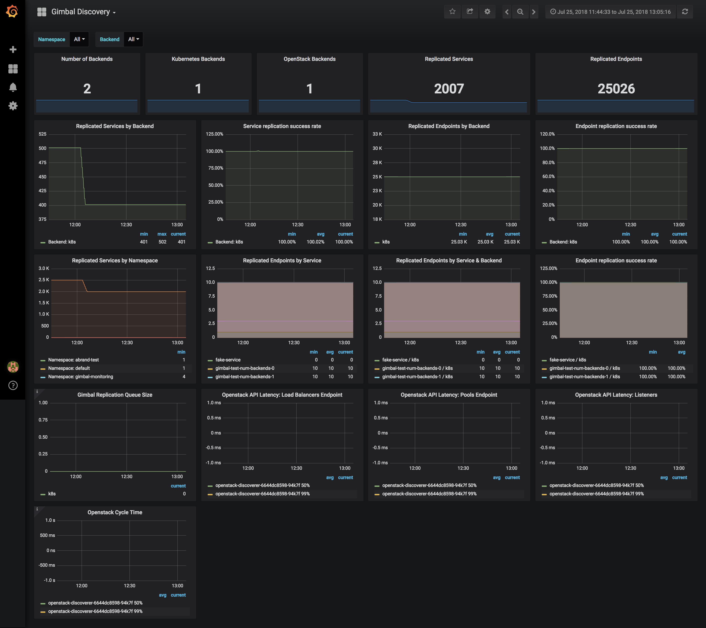

<!-- TOC -->

- [Monitoring](#monitoring)
    - [Dashboards](#dashboards)
        - [Contour](#contour)
        - [Envoy](#envoy)
        - [Gimbal Discoverers](#gimbal-discoverers)
        - [Grafana](#grafana)
    - [Metrics](#metrics)
        - [Envoy](#envoy-1)
        - [Gimbal Discoverer](#gimbal-discoverer)
    - [Alerts](#alerts)
        - [Alert rules](#alert-rules)
        - [Sample Alerting Rules](#sample-alerting-rules)

<!-- /TOC -->

# Monitoring

Perhaps one of the most essential components of the entire system is the monitoring suite.  Each Gimbal system component exposes a Prometheus-compatible /metrics route to provide health status and essential metrics.  These metrics are scraped by Prometheus, which then aggregates and stores them for real-time monitoring and alerting.

Open-source tools:
- Prometheus: [https://prometheus.io/](https://prometheus.io/)
- Alertmanager: [https://prometheus.io/docs/alerting/alertmanager/](https://prometheus.io/docs/alerting/alertmanager/)
- Grafana: [https://grafana.com/](https://grafana.com/)

## Dashboards

Administrators and teams can gain real-time insights into the health, performance, and configuration of Contour using one or more Dashboards. These web-based dashboards are built using an open-source analytics and monitoring platform called Grafana. To access Grafana, check with your Gimbal administrator to see if it is already exposed from the cluster.

### Contour

The Contour Dashboard shows an overview of the updates happening to Envoy's RDS, CDS, and LDS components as well as the status of IngressRoutes in the cluster.

- **Total IngressRoutes:** Total number of IngressRoutes objects that exist regardless of status (i.e. Valid / Invalid / Orphaned, etc) tagged by namespace. This metric should match the sum of `Orphaned` + `Valid` + `Invalid` IngressRoutes
- **Orphaned IngressRoutes:**  Number of `Orphaned` IngressRoute objects which have no root delegating to them tagged by namespace
- **Root IngressRoutes:**  Number of `Root` IngressRoute objects (Note: There will only be a single `Root` IngressRoute per vhost) tagged by namespace
- **Valid IngressRoutes:**  Number of `Valid` IngressRoute objects tagged by namespace and vhost
- **Total IngressRoutes:**  Number of `Invalid` IngressRoute objects tagged by namespace and vhost
- **Contour Updates:** These metrics show the number of Successful, Failed, and Rejected updates to the Envoy cluster discovery service (CDS), listener discovery service (LDS), and the route discovery service (RDS)



### Envoy

The Envoy dashboard shows an overview of upstream as well as downstream metrics emitted from Envoy. 

See docs for more information: [https://www.envoyproxy.io/docs/envoy/latest/configuration/cluster_manager/cluster_stats](https://www.envoyproxy.io/docs/envoy/latest/configuration/cluster_manager/cluster_stats)



### Gimbal Discoverers

The Discoverers emit metrics relating to the type of backend it is discovering (e.g. Kubernetes or OpenStack):



### Grafana

If you have access to the `gimbal-monitoring` namespace inside the Gimbal cluster, run the following commands to connect to Grafana:

```sh
$ kubectl port-forward $(kubectl get pods -l app=grafana -n gimbal-monitoring -o jsonpath='{.items[0].metadata.name}') 3000 -n gimbal-monitoring
```

Access Grafana at http://localhost:3000 in your browser. The default username is `admin` and the password is `admin`. However, your Gimbal administrator may set these to different values. 

Some dashboards are loaded into Grafana with the Gimbal installation:

## Metrics

### Envoy

Envoy emits a large number of statistics depending on how it is configured. These statistics fall into three categories:

- **Downstream:** Downstream statistics relate to incoming connections/requests. They are emitted by listeners, the HTTP connection manager, the TCP proxy filter, etc.
- **Upstream:** Upstream statistics relate to outgoing connections/requests. They are emitted by connection pools, the router filter, the TCP proxy filter, etc.
- **Server:** Server statistics describe how the Envoy server instance is working. Statistics like server uptime or amount of allocated memory are categorized here.

Envoy emits three types of values as statistics:

- **Counters:** Unsigned integers that only increase and never decrease, for example total requests.
- **Gauges:** Unsigned integers that both increase and decrease, for example currently active requests.
- **Histograms:** Unsigned integers that are part of a stream of values that are then aggregated by the collector to ultimately yield summarized percentile values, for example upstream request time.

Detailed documentation on stats within Envoy is available on their site: https://www.envoyproxy.io/docs/envoy/latest/configuration/cluster_manager/cluster_stats#config-cluster-manager-cluster-stats

### Gimbal Discoverer

- Metrics
  - **gimbal_service_event_timestamp (gauge):** Timestamp last service event was processed with following labels:
    - namespace
    - backendname
    - name
    - backendtype
  - **gimbal_endpoints_event_timestamp (gauge):** Timestamp last endpoints event was processed with following labels:
    - namespace
    - backendname
    - name
    - backendtype
  - **gimbal_service_error_total (counter):** Number of errors encountered while processing services, with the following labels:
    - namespace
    - backendname
    - name
    - errortype: type of error encountered
    - backendtype
  - **gimbal_endpoints_error_total (counter):** Number of errors encountered while processing endpoints, with the following labels:
    - namespace
    - backendname
    - name
    - errortype: type of error encountered
    - backendtype
  - **gimbal_queuesize (gauge):** Number of items in process queue with the following labels:
    - backendname
    - backendtype
  - **gimbal_discoverer_api_latency_milliseconds (histogram):** The milliseconds it takes for requests to return from a remote discoverer api (for example OpenStack)
    - backendname
    - backendtype
    - path: API request path
  - **gimbal_discoverer_cycle_duration_seconds (histogram):** The seconds it takes for all objects to be synced from a remote backend (for example OpenStack)
    - backendname
    - backendtype
  - **gimbal_discoverer_api_error_total (counter):** Number of errors that have occurred when accessing the OpenStack API
    - backendname
    - errortype: type of error encountered
    - backendtype
    - operationtype: operation that was being performed (for example listing projects, listing LBs, listing pool members, getting pool member info)
  - **gimbal_discoverer_error_total (counter):** Number of errors that have occurred in the Discoverer
    - backendname
    - errortype: type of error encountered
    - backendtype
  - **gimbal_discoverer_upstream_services_total (gauge):** Total number of services in the backend cluster (Kubernetes: The default kubernetes service is not counted).
    - backendname
    - namespace
    - backendtype
  - **gimbal_discoverer_replicated_services_total (gauge):** Total number of services replicated/synced
    - backendname
    - namespace
    - backendtype
  - **gimbal_discoverer_invalid_services_total (gauge):** Total count of services that are unable to be replicated/synced
    - backendname
    - namespace
  - **gimbal_discoverer_upstream_endpoints_total (gauge):** Total number of endpoints - meaning IP:Port - in the upstream backend cluster
    - backendname
    - service
    - namespace
    - backendtype
  - **gimbal_discoverer_replicated_endpoints_total (gauge):** Total number of endpoints - meaning IP:Port replicated/synced
    - backendname
    - service
    - namespace
    - backendtype
  - **gimbal_discoverer_info (gauge):** Describes discoverer environment version information
    - backendname
    - version
    - backendtype

## Alerts

Gimbal leverages Alertmanager, an open source tool for managing alerts including silencing, inhibition, aggregation, and sending notifications by email, PagerDuty, Slack, and webhooks.  Specific alerts are triggered by the monitoring system either through Prometheus alerts or from internal Contour components using the Alertmanager Client API.  Alertmanager supports a number of notification strategies and templates. For more information, see [the Alertmanager documentation](https://prometheus.io/docs/alerting/notifications/).

### Alert rules

Alert rules are a collection of Prometheus queries where you can set thresholds and decide when to fire off an alert. These alert rules are evaluated by Prometheus, so the rules config file must be attached to the Prometheus deployment.

To update alert rules, add new rules config values to the `prometheus-alert-rules` [configmap](../deployment/prometheus/02-prometheus-alertrules-configmap.yaml) in the `gimbal-monitoring` namespace.

### Sample Alerting Rules

The following are example alerts that can be configured to monitor Gimbal. Feel
free to customize them to fit your requirements.

```yaml

apiVersion: v1
kind: ConfigMap
metadata:
  name: prometheus-alert-rules
  namespace: gimbal-monitoring
data:
  alert.rules: |-
    groups:
    # Alerts for the Gimbal discovery components
    - name: discovery-rules
      rules:
      - alert: LowServiceReplicationSuccessRate
        expr: avg((gimbal_discoverer_replicated_services_total / gimbal_discoverer_upstream_services_total) * 100) by (backendname) < 100
        for: 1m
        labels:
          severity: page
        annotations:
          summary: "Service replication success rate below 100%"
          description: "The discoverer for backend {{ $labels.backendname }} reported a service replication success rate of {{ $value }}% for more than 1 minute."
      - alert: LowEndpointsReplicationSuccessRate
        expr: round((sum(gimbal_discoverer_replicated_endpoints_total) by (backendname) / sum(gimbal_discoverer_upstream_endpoints_total) by (backendname)) * 100, 0.01) < 100
        for: 1m
        labels:
          severity: page
        annotations:
          summary: "Endpoints replication success rate below 100%"
          description: "The discoverer for backend {{ $labels.backendname }} reported an endpoints replication success rate of {{ $value }}% for more than 1 minute."
```

