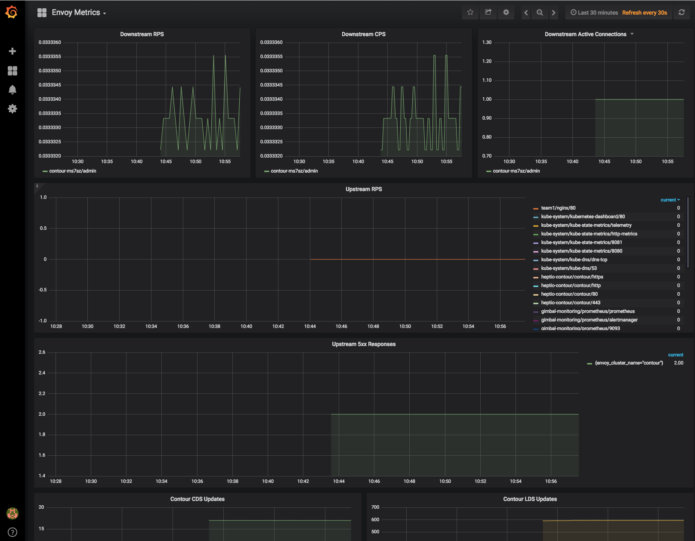
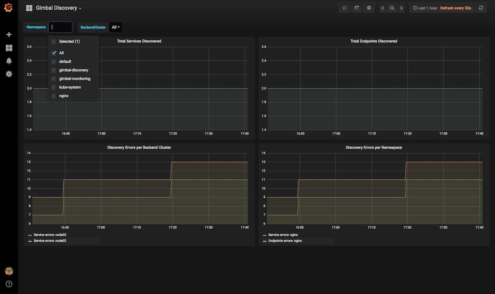

<!-- TOC -->

- [Monitoring](#monitoring)
    - [Dashboards](#dashboards)
        - [Grafana](#grafana)
            - [Envoy Dashboard](#envoy-dashboard)
            - [Gimbal Dashboard](#gimbal-dashboard)
    - [Metrics](#metrics)
        - [Envoy](#envoy)
        - [Gimbal Discoverer](#gimbal-discoverer)
    - [Alerts](#alerts)
        - [Alert Rules](#alert-rules)

<!-- /TOC -->

# Monitoring

Perhaps one of the most essential components to the entire system is the monitoring suite.  Each Gimbal system component will expose a Prometheus-compatible /metrics route with health status and essential metrics.  These metrics will be scraped by Prometheus which will aggregate and store the metrics for real-time monitoring and alerting. 

Links to the open-source tools utilized in this section:
- Prometheus: [https://prometheus.io/](https://prometheus.io/)
- Alert Manager: [https://prometheus.io/docs/alerting/alertmanager/](https://prometheus.io/docs/alerting/alertmanager/)
- Grafana: [https://grafana.com/](https://grafana.com/)

## Dashboards

Administrators and Teams alike will be able to gain real time insights into the health, performance, and configuration of Contour using one or more Dashboards. These web-based dashboards will be built using an open-source analytics and monitoring platform called Grafana. To access Grafana, please check with your Gimbal administrator to see if it has been exposed from the cluster already. 

### Grafana

If you have access to the `gimbal-monitoring` namespace inside the Gimbal cluster, the following commands can get connected to Grafana quickly:

```sh
$ kubectl port-forward $(kubectl get pods -l app=grafana -n gimbal-monitoring -o jsonpath='{.items[0].metadata.name}') 3000 -n gimbal-monitoring
```

Access Grafana at http://localhost:3000 in your browser. The default username is `admin` and password is `admin`, but those may be different depending on how the Gimbal administrator has configured the system. 

Some dashboards come pre-loaded into Grafana via the Gimbal installation. These dashboards are visible within Grafana.

#### Envoy Dashboard



#### Gimbal Dashboard



## Metrics

### Envoy

Envoy emits a large number of statistics depending on how it is configured, statistics fall into three categories:

- **Downstream:** Downstream statistics relate to incoming connections/requests. They are emitted by listeners, the HTTP connection manager, the TCP proxy filter, etc.
- **Upstream:** Upstream statistics relate to outgoing connections/requests. They are emitted by connection pools, the router filter, the TCP proxy filter, etc.
- **Server:** Server statistics describe how the Envoy server instance is working. Statistics like server uptime or amount of allocated memory are categorized here.

Envoy emits three types of values as statistics:

- **Counters:** Unsigned integers that only increase and never decrease. E.g., total requests.
- **Gauges:** Unsigned integers that both increase and decrease. E.g., currently active requests.
- **Histograms:** Unsigned integers that are part of a stream of values that are then aggregated by the collector to ultimately yield summarized percentile values. E.g., upstream request time. _NOTE: Histograms are not currently supported in Prometheus directly._

Detailed documentation on stats within Envoy are available on their site: https://www.envoyproxy.io/docs/envoy/latest/configuration/cluster_manager/cluster_stats#config-cluster-manager-cluster-stats

### Gimbal Discoverer

The Gimbal Discoverer currently has two different systems it can monitor, Kubernetes and Openstack. The purpose of the Discoverers are to perform service discovery for remote clusters by finding remote endpoints and synchronizing them to the Gimbal cluster as Services & Endpoints.

- Metrics
  - **gimbal_service_event_timestamp (gauge):** Timestamp last service event was processed with following labels:
    - namespace
    - clustername
    - name
  - **gimbal_endpoints_event_timestamp (gauge):** Timestamp last endpoints event was processed with following labels:
    - namespace
    - clustername
    - name
  - **gimbal_service_error_total (counter):** Number of errors encountered while processing services, with the following labels:
    - namespace
    - clustername
    - name
    - errortype: type of error encountered
  - **gimbal_endpoints_error_total (counter):** Number of errors encountered while processing endpoints, with the following labels:
    - namespace
    - clustername
    - name
    - errortype: type of error encountered
  - **gimbal_queuesize (gauge):** Number of items in process queue with the following labels:
    - namespace
    - clustername
    - clustertype
  - **gimbal_discoverer_api_latency_ms (gauge):** The milliseconds it takes for requests to return from a remote discoverer api (e.g. Openstack)
    - clustername
    - clustertype
    - path: API request path
  - **gimbal_discoverer_cycle_duration_ms (gauge):** The milliseconds it takes for all objects to be synced from a remote discoverer api (e.g. Openstack)
    - clustername
    - clustertype
  - **gimbal_discoverer_api_error_total (counter):** Number of errors that have occurred when accessing   the openstack API
    - clustername
    - errortype: type of error encountered
    - clustertype
    - operationtype: operation that was being performed (e.g. listing projects, listing LBs, listing pool members, getting pool member info, etc)
  - **gimbal_discoverer_error_total (counter):** Number of errors that have occurred in the Discoverer
    - clustername
    - errortype: type of error encountered

## Alerts

Gimbal leverages AlertManager, an open source tool for managing alerts including silencing, inhibition, aggregation, and sending out notifications via methods such as email, PagerDuty, Slack, and web-hooks.  Specific Alerts will be triggered by the Monitoring System either through Prometheus alerts or from internal Contour components using the AlertManager Client API.  AlertManager supports a number of notification strategies and templates which can be seen in the documentation

### Alert Rules

Alert Rules are a collection of Prometheus queries where you can set thresholds and decide when to fire off an alert. These alert rules are evaluated within Prometheus, so this rules config file will be attached to the Prometheus deployment.

To update the configured Alert Rules, add them to the `prometheus-alert-rules` [configmap](../deployment/prometheus/02-prometheus-alertrules-configmap.yaml) in the `gimbal-monitoring` namespace. 